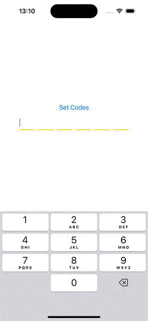

# VerficationTextField
VerficationTextField for iOS under iOS 15




In a mobile phone verification code input, you need to switch to the next input field automatically after entering a digit. In SwiftUI, achieving this requires switching focus (becomeFirstResponder) among multiple Textfields to accomplish the functionality.
In iOS 15, this can be implemented using the focused
https://www.hackingwithswift.com/quick-start/swiftui/how-to-make-a-textfield-or-texteditor-have-default-focus
However, for iOS versions below 15, TextField does not support @FocusState, so an alternative approach is needed.
This VerficationTextField component integrates UITextField into SwiftUI through UIViewRepresentable.
It manages a single character input field and implements focus control as well as triggering actions on text changes and deletions. This article uses UIViewRepresentable to encapsulate UIKit and implement the focus switching functionality for Textfield types:

- Automatically switch focus to the next Textfield after entering a digit

- Automatically switch to the previous Textfield when the delete key is pressed

```
struct VerficationTextField: UIViewRepresentable {

    @Binding var text: String
    var isFirstResponder: Bool
    let onChanged: (String) -> Void
    var onDelete: (() -> Void)

    class Coordinator: NSObject, UITextFieldDelegate {

        @Binding var text: String
        var onDelete: (() -> Void)
        let onChanged: (String) -> Void

        init(
            text: Binding<String>, onChanged: @escaping (String) -> Void,
            onDelete: @escaping (() -> Void)
        ) {
            _text = text
            self.onChanged = onChanged
            self.onDelete = onDelete
        }

        func textFieldDidChangeSelection(_ textField: UITextField) {
            self.text = textField.text ?? ""
            self.onChanged(textField.text ?? "")
        }

        func textField(
            _ textField: UITextField, shouldChangeCharactersIn range: NSRange,
            replacementString string: String
        ) -> Bool {
            if string.isEmpty {
                textField.text = ""
                self.onDelete()
                return false
            }

            // If the new input is a number and there are already characters in the current text box, set the text to the new input character
            if string.count == 1 {
                textField.text = string
                self.text = string
                self.onChanged(string)
                return false
            }

            return true
        }

    }

    func makeCoordinator() -> VerficationTextField.Coordinator {
        return Coordinator(text: $text, onChanged: onChanged, onDelete: onDelete)
    }

    func makeUIView(context: UIViewRepresentableContext<VerficationTextField>) -> UITextField {
        let textField = UITextField(frame: .zero)
        textField.keyboardType = .numberPad
        textField.delegate = context.coordinator
        return textField
    }

    func updateUIView(
        _ uiView: UITextField, context: UIViewRepresentableContext<VerficationTextField>
    ) {
        uiView.text = text
        if isFirstResponder {
            uiView.becomeFirstResponder()
        }
    }
}
```


VerficationCodeView
This VerficationCodeView component allows users to enter a 6-digit verification code, with each input field only allowing one digit. The custom input field component implements input focus management and manual focus shift on delete key press. The changeFirstResponder method effectively manages which input field has the focus.

```
struct VerficationCodeView: View {
    @State private var codes: [String] = Array(repeating: "", count: 6)
    @State private var isFirstResponders: [Bool] = [true, false, false, false, false, false]

    func changeFirstResponder(_ idx: Int) {
        for i in 0..<isFirstResponders.count {
            if i != idx {
                isFirstResponders[i] = false
            } else {
                isFirstResponders[i] = true
            }
        }
    }
    var body: some View {
        VStack {

            Button("Set Codes") {
                self.codes = ["1", "2", "3", "4", "5", "6"]
            }

            HStack(spacing: 10) {
                ForEach(0..<6, id: \.self) { index in

                    VerficationTextField(
                        text: $codes[index],
                        isFirstResponder: isFirstResponders[index],
                        onChanged: { value in
                            self.changeFirstResponder(index + 1)
                        },
                        onDelete: {
                            self.changeFirstResponder(index - 1)
                        }
                    )
                    .frame(width: 40, height: 40)
                    .multilineTextAlignment(.center)
                    .padding(.top, 0)
                    .overlay(
                        VStack {
                            Spacer()
                            Rectangle()
                                .frame(height: 2)
                                .foregroundColor(Color.yellow)
                        }
                    )

                }
            }

        }
    }
}

```